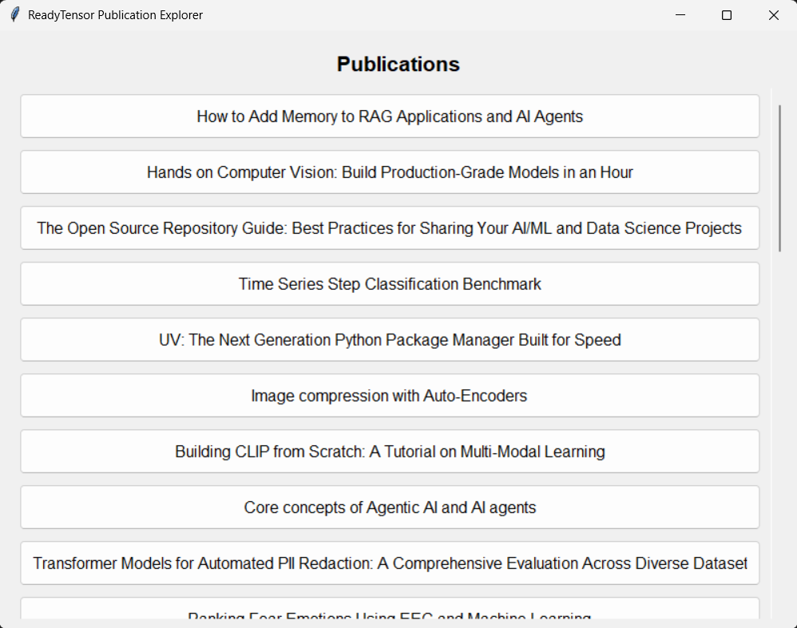
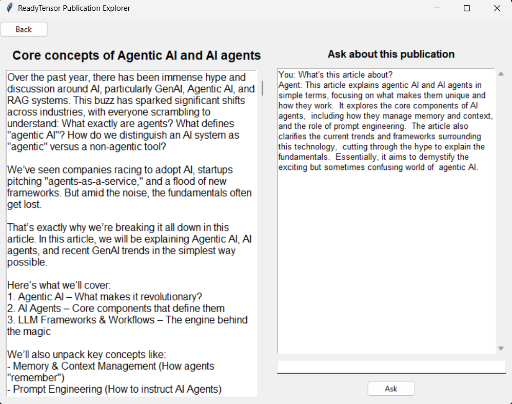

# [Ready Tensor](https://app.readytensor.ai/) Publication Explorer
AAIDC Project 1: A RAG-based assistant that answers questions about Ready Tensor publications

## Overview

This project is the implementation of a RAG-based assistant designed to answer questions regarding some Ready Tensor publications stored in a dataset. Built with [LangChain](https://www.langchain.com/) and Google's [Gemini LLM](https://ai.google.dev/), it uses a Retrieval-Augmented Generation (RAG) pipeline to provide concise, non-expert-friendly answers or summaries. 

## Project Structure

The directory structure of the project:

- `data/`: 
  - `publications.json`: dataset of some publications. Example:
```json
  [
      {
          "id": "pub1",
          "username": "author1",
          "license": "none"
          "title": "Sample Publication",
          "publication_description": "Content...",
      }
  ]
```
- `src/`:
  - `document_loader.py`: Processes and cleans the publications data, and builds a Chroma vector store.
  - `rag_pipeline.py`: Implements the RAG pipeline for querying.
  - `prompt.txt`: Defines the RAG prompt template
  - `cli.py`: CLI script for querying publications via terminal. [Debugging]
  - `ui.py`: GUI (Tkinter) script for browsing and querying publications. 
- `README.md`: You are here! 🏳
- `requirements.txt`: List of dependencies.
- `run.py`: Entry point (run `cli.py` or `ui.py`).

## Setup
- Install dependencies:
  
  ```bash
  pip install -r requirements.txt
  ```
  Note: install `tkinter` too if not included.

<br>

- Acquire a Gemini API key:
  -  Go to [Google Cloud Console](https://console.cloud.google.com/).
  -  Open or create a project with enabled `Gemini API` (Navigate to "APIs & Services", "Enable APIs and services", and Search for "Gemini API" and enable it)
  -  Retrieve or create an API key (Go to the API's details page -> "Create credentials")

<br>

- Create a `.env` file in <i>this</i> project's root and include the Gemini API key there:

  ```txt
  GEMINI_API_KEY=your-api-key-here
  ```

<br>

- Run:

  ```bash
  python run.py
  ```

## Usage:

The application should open to a screen listing available publications. Clicking any of them should move to a second screen displaying the content of the selected article and a chat box that allows asking the agent about that current article.

 

<hr>
